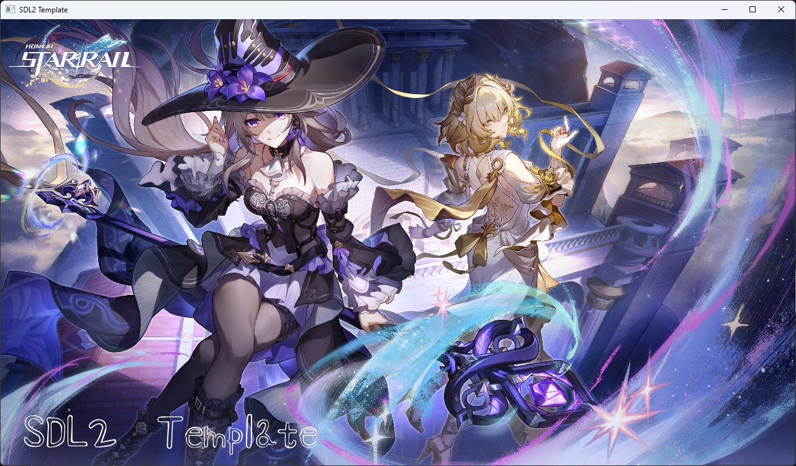

# SDL2 Template

This is a SDL2 template with image, text and music support made using Meson.

## Preview


## Installation

To use this template, you must have Meson, Ninja, CMake, make, g++/clang++ along with required headers installed.
If you don't have these installed then you should use MSYS2 to install them (or use https://github.com/justapieop/SDLTesting/tree/dev for a better experience)

```bash
git clone https://github.com/teppyboy/sdl2-template
cd sdl2-template
meson setup builddir  # Needed for installing SDL2 libraries to the project.
```

## Building

### The project itself

+ Debug
```bash
meson compile -C ./builddir
cp -r assets ./builddir/
```
The output will be in `./builddir`

+ Release
```bash
meson setup builddir-release --buildtype release --optimization 3 --strip
meson compile -C ./builddir-release
cp -r assets ./builddir-release/
```
The output will be in `./builddir-release`

## Why?

Because of my university, and no I don't wanna use Code::Blocks. ~~Also plain vcpkg doesn't work with my MSYS2 and MSVC combined install somehow~~

## Acknowledgements

+ Background picture: [Honkai: Star Rail 3.0 official illustration.](https://www.reddit.com/r/HonkaiStarRail/comments/1hr4mde/30_official_illustration_hq/)
+ Music: [Hope Is the Thing With Feathers · Robin · HOYO-MiX · Chevy · 王可鑫](https://www.youtube.com/watch?v=aPyt41nnM0k)
+ Font used: [Shizuru](https://fonts.google.com/specimen/Shizuru)

## License

[MIT](./LICENSE)
